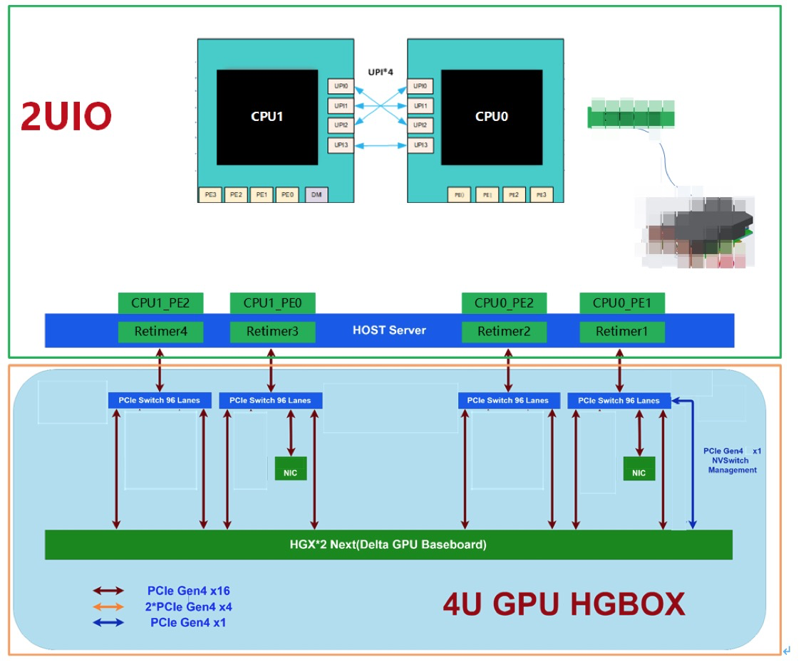

# Alibaba Sinian A100 Platform System Architecture

Alibaba's Sinian-A100 system supports the [GPUDirect](https://developer.nvidia.com/gpudirect) capability of NVIDIA GPUs to transfer data directly from PCIe devices (e.g. network, storage or camera) to GPU device memory. Each A100 GPUs in the system is connected to a PCIe-Gen4 bridge, which is also connected to two 100Gb-bandwidth NICs.

The highest bandwidth requirement for Alibaba's submissions requires about 18GB/s which is lower than the 200Gb network bandwidth.

